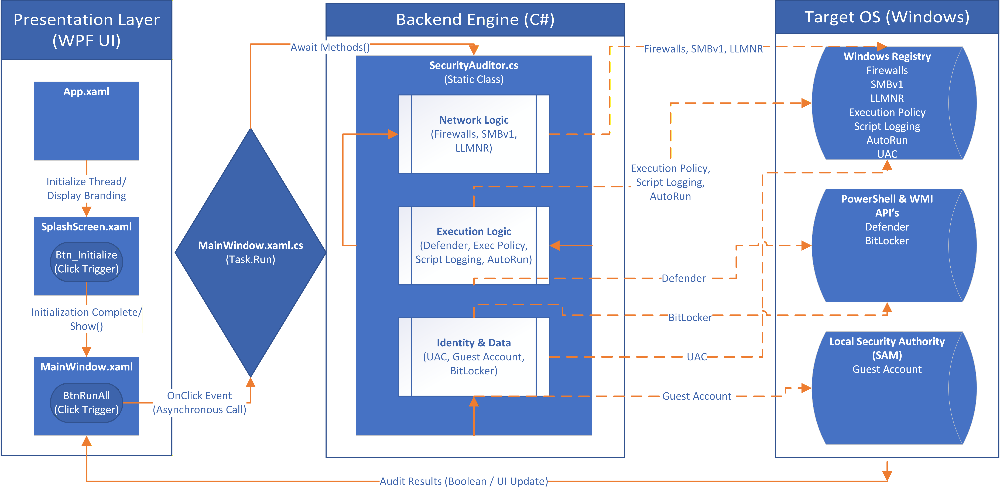

# EndpointAuditor

A lightweight, zero-telemetry endpoint security auditing tool built in C#. 

EndpointAuditor safely queries the Windows Registry, native PowerShell cmdlets, and WMI namespaces to verify the integrity of critical system configurations. Designed with a strict "Read-Only" architecture, the tool evaluates system posture without the risk of accidental modification or system instability, presenting the data in a responsive, cyberpunk-inspired dashboard.

## 🛡️ The 10-Point Security Matrix

Version 3.0 expands the auditing scope to cover ten high-value targets across three core domains, mapped to enterprise security baselines:

## [ NETWORK LOGIC ]

1. **Windows Firewall Profiles:** Verifies that Domain, Private, and Public network filtering are actively engaged to prevent unauthorized ingress.
2. **Legacy SMBv1 Protocol:** Scans for the active presence of the SMB1Protocol-Server component, mitigating vulnerability to lateral movement exploits (e.g., EternalBlue).
3. **LLMNR Resolution:** Ensures Link-Local Multicast Name Resolution is disabled via the registry to prevent local network credential poisoning.

## [ EXECUTION LOGIC ]

4. **Defender Anti-Virus:** Bypasses Tamper Protection via direct API queries to ensure the core real-time protection engine is active.
5. **Execution Policy:** Validates that PowerShell execution is restricted to authorized or signed scripts.
6. **Script Block Logging:** Verifies forensic logging is enabled for advanced threat hunting and incident response.
7. **USB AutoRun:** Ensures malicious payload auto-execution from external drives is globally disabled.

## [ IDENTITY & DATA ]

8. **User Account Control (UAC):** Validates both the EnableLUA core engine state and the UI consent prompt settings to prevent silent administrative privilege escalation.
9. **Built-in Guest Account:** Ensures the default Windows Guest account is disabled, mitigating anonymous network access.
10. **BitLocker Encryption:** Verifies primary drive encryption. Implements intelligent OS-edition detection to gracefully bypass the check on unsupported Home editions.

## 🏗️ Architecture & Asynchronous Design

This application enforces strict **Separation of Concerns** to prevent UI thread blocking during heavy system queries:

**SecurityAuditor.cs:** The standalone backend engine. Handles all business logic, local system queries, and fail-safe try/catch exception handling.

**MainWindow.xaml & App.xaml:** The WPF presentation layer featuring responsive grids, dynamic drop-shadows, and a custom multi-domain color palette.

**MainWindow.xaml.cs:** The bridge leveraging Task.Run() to execute security modules asynchronously, ensuring a highly responsive user experience during scans.

## 🚀 Deployment & Execution

*Note: EndpointAuditor **requires Administrative privileges** (enforced via app.manifest) to successfully query locked registry hives (like UAC configurations) and execute native PowerShell modules.*

1. Clone the repository.
2. Open `EndpointAuditor.sln` in Visual Studio.
3. Build the solution in **Release** mode.
4. Run the resulting `EndpointAuditor.exe` as an Administrator. 

## 🗺️ Roadmap
- **Phase 1:** Minimum Viable Product (CLI Engine) (5 Checks) - *Completed*
- **Phase 2:** Transition to a polished Graphical User Interface (GUI) dashboard for enhanced usability. - *Completed*
- **PHASE 3:** Advanced Asynchronous WPF Dashboard (10 Checks) - *Completed*
- **PHASE 4:** One-Click Auto-Remediation and CSV Audit Log Export capabilities (15 Checks).
